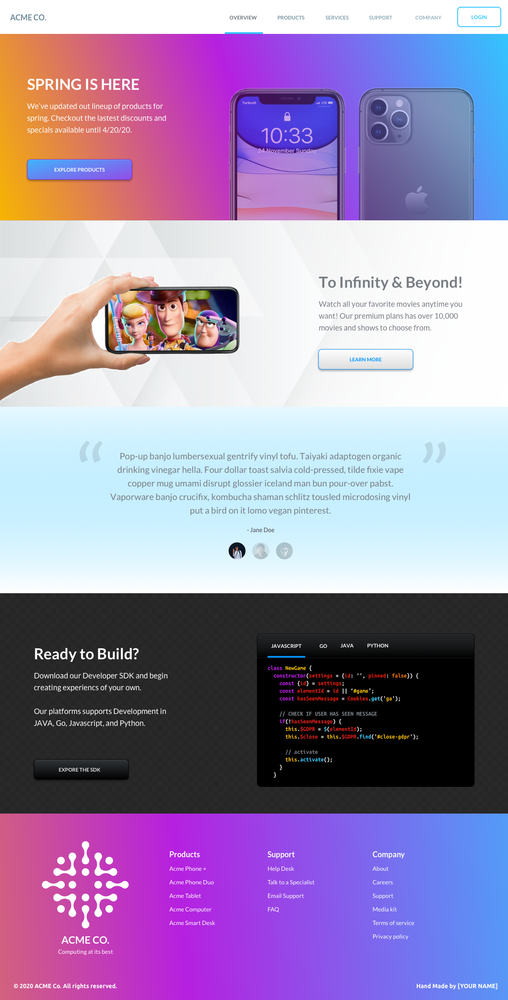

# A Front-End Portfolio Project

## This project is made with HTML, CSS, and Javascript.

### Checkout the website at https://s-vaitla1.github.io/frontendUIacme/

## Summary

Create a fictitious website using HTML and CSS and the designs provided by the client(ACME CO.). 

